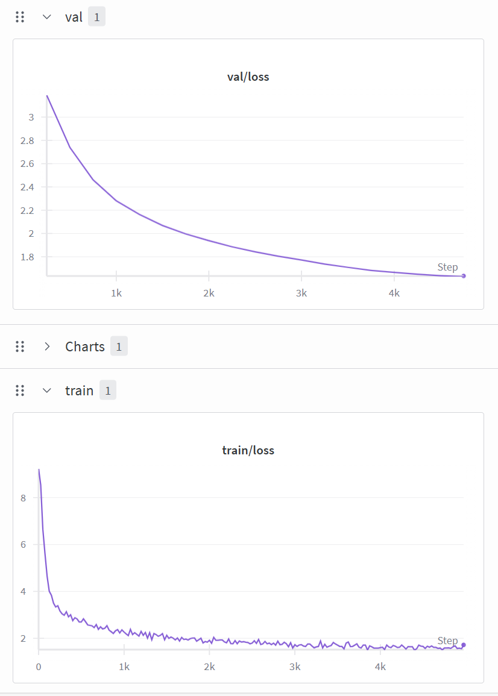

# CS336 Spring 2025 Assignment 1: Basics (Finished)
For a full description of the assignment, see the assignment handout at
[cs336_spring2025_assignment1_basics.pdf](./cs336_spring2025_assignment1_basics.pdf)

## Personal implementation
**src**
```bash
tests/test_data.py
```

**Environmental installation**
```bash
pip install uv
```

**Test all modules**
```bash
uv run pytest
```

**Test specified module**
```bash
uv run pytest tests/test_xx.py
```
## Train

1. **Training BPE Tokenization**
    ```bash
    uv run train_bpe.py
    ```

2. **Training Transformer**
    ```bash
    uv run train_transformer.py
    ```

3. **Using Transformer for Inference**
    ```bash
    uv run train_transformer.py
    ```



## Setup

### Environment
We manage our environments with `uv` to ensure reproducibility, portability, and ease of use.
Install `uv` [here](https://github.com/astral-sh/uv) (recommended), or run `pip install uv`/`brew install uv`.
We recommend reading a bit about managing projects in `uv` [here](https://docs.astral.sh/uv/guides/projects/#managing-dependencies) (you will not regret it!).

You can now run any code in the repo using
```sh
uv run <python_file_path>
```
and the environment will be automatically solved and activated when necessary.

### Run unit tests


```sh
uv run pytest
```

Initially, all tests should fail with `NotImplementedError`s.
To connect your implementation to the tests, complete the
functions in [./tests/adapters.py](./tests/adapters.py).

### Download data
Download the TinyStories data and a subsample of OpenWebText

``` sh
mkdir -p data
cd data

wget https://hf-mirror.com/datasets/roneneldan/TinyStories/resolve/main/TinyStoriesV2-GPT4-train.txt
wget https://hf-mirror.com/datasets/roneneldan/TinyStories/resolve/main/TinyStoriesV2-GPT4-valid.txt

wget https://hf-mirror.com/datasets/stanford-cs336/owt-sample/resolve/main/owt_train.txt.gz
gunzip owt_train.txt.gz
wget https://hf-mirror.com/datasets/stanford-cs336/owt-sample/resolve/main/owt_valid.txt.gz
gunzip owt_valid.txt.gz

cd ..
```

